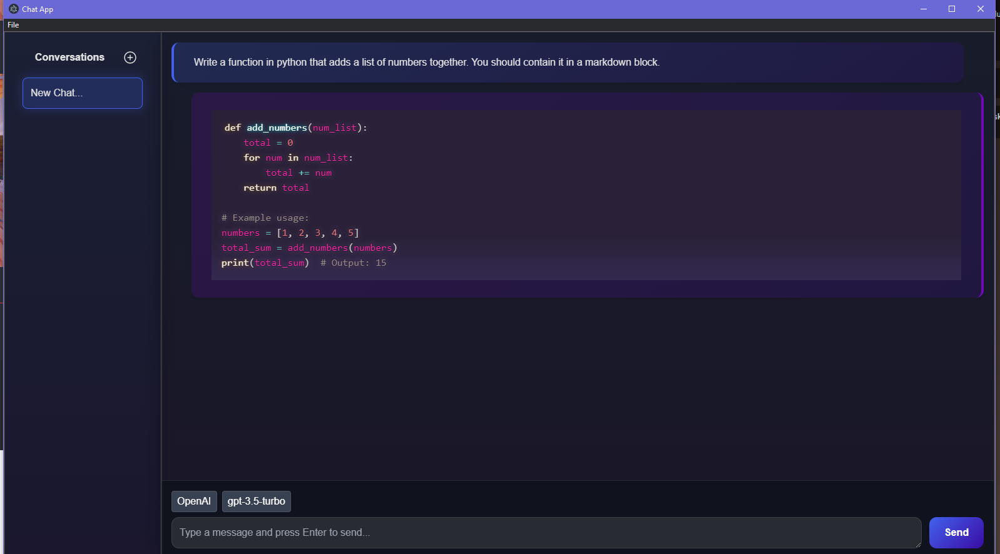

# chat-app

LLM Chat application using Electron with React and TypeScript.



## TODO

- [x] Conversation List
- [x] Token streaming
- [x] Syntax highlighting for code blocks
- [x] Nifty styling (Courtesy of Claude Sonnet 3.5)
- [ ] RAG?
- [ ] Chat persistence
- [ ] More providers/models
- [ ] API Key persistence
- [ ] Preferences window

## Recommended IDE Setup

- [VSCode](https://code.visualstudio.com/) + [ESLint](https://marketplace.visualstudio.com/items?itemName=dbaeumer.vscode-eslint) + [Prettier](https://marketplace.visualstudio.com/items?itemName=esbenp.prettier-vscode)

## Project Setup

### Install

```bash
$ npm install
```

You need to create a `.env` file with API keys right now. An OpenAI key is a good starting place.

.env

```.env
GROQ_API_KEY=...
OPENAI_API_KEY=...
ANTHROPIC_API_KEY=...
```

### Development

```bash
$ npm run dev
```

### Build

```bash
# For windows
$ npm run build:win

# For macOS
$ npm run build:mac

# For Linux
$ npm run build:linux
```
